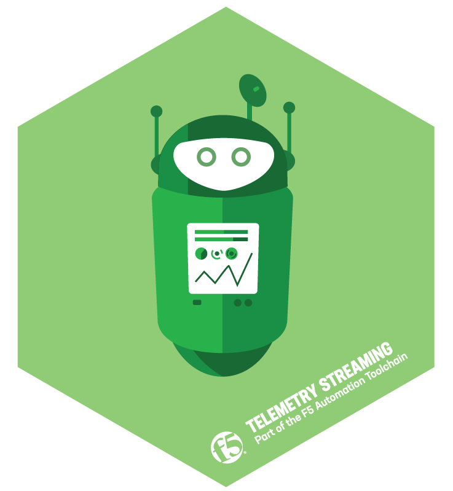

# Introduction



Telemetry Streaming is an iControl LX extension to stream telemetry from BIG-IP(s) to analytics consumers such as the following.

- Splunk
- Azure Log Analytics
- AWS CloudWatch
- AWS S3
- Graphite
- Kafka
- Elastic Search
- Sumo Logic

## Contents

- [Overview](#overview)
- [Configuration Examples](#configuration-examples)
- [REST API Endpoints](#rest-api-endpoints)
- [Output Example](#output-example)
- [Container](#container)

## Overview

The telemetry streaming design accounts for a number of key components, including ***System Poller***, ***Event Listener*** and ***Consumer***.  Those are described in more detail below.

### System Poller

Definition: Polls a system on a defined interval for information such as device statistics, virtual server statistics, pool statistics and much more.

### Event Listener

Definition: Provides a listener, currently TCP, that can accept events in a specic format and process them.

Event Format: ```key1="value",key2="value"```

### Consumer

Definition: Accepts information from disparate systems and provides the tools to process that information.  In the context of Telemetry Streaming this simply means providing a mechanism by which to integrate with existing analytics products.

## Configuration examples

### Basic

`POST /mgmt/shared/telemetry/declare`

```json
{
    "class": "Telemetry",
    "controls": {
        "class": "Controls",
        "logLevel": "info"
    },
    "My_Poller": {
        "class": "Telemetry_System_Poller",
        "interval": 60
    },
    "My_Listener": {
        "class": "Telemetry_Listener",
        "port": 6514
    },
    "My_Consumer": {
        "class": "Telemetry_Consumer",
        "type": "Splunk",
        "host": "192.0.2.1",
        "protocol": "http",
        "port": "8088",
        "passphrase": {
            "cipherText": "apikey"
        }
    }
}
```

### Controls

There is a fixed class called "Controls", which contains a number of properties:

- logLevel - logging level, possible values are **debug**, **info**, **error**. Default value is **info**

```json
{
    "controls": {
        "class": "Controls",
        "logLevel": "info"
    }
}
```

### Additional properties

The schema has some additional properties which might not be covered elesewhere, defined below.

- trace
  - Definition: Useful during debug of TS because it dumps intermediate data to file.
  - Values:
    - *false* - tracer disabled
    - *true* - tracer enabled, file name will be **DEFAULT_LOCATION/OBJ_TYPE.OBJ_NAME** - Default location for files is **/var/tmp/telemetry**
    - *string* - custom path to file
  - Note: Applies to the Telemetry_System_Poller, Telemetry_Listener and Telemetry_Consumer class(es)
- match
  - Definition: Provide a string or pattern (regex) which will result in events being dropped that do not match the value of a defined set of keys in the event.  Defined keys: ```virtual_name, policy_name, Access_Profile, context_name```
  - Values: String or pattern (regex)
  - Note: Applies to the Telemetry_Listener class

### Splunk

Website: [https://www.splunk.com](https://www.splunk.com).

Required information:

- Host: The address of the Splunk instance that runs the HTTP event collector (HEC).
- Protocol: Check if TLS is enabled within the HEC settings (Settings > Data Inputs > HTTP Event Collector).
- Port: Default is 8088, this can be configured within the Global Settings section of the Splunk HEC.
- API Key: An API key must be created and provided in the passphrase object of the declaration, refer to Splunk documentation for the correct way to create an HEC token.

Note: More information about using the HEC can be found on the Splunk website [here](http://docs.splunk.com/Documentation/Splunk/latest/Data/UsetheHTTPEventCollector).

```json
{
    "My_Consumer": {
        "class": "Telemetry_Consumer",
        "type": "Splunk",
        "host": "192.0.2.1",
        "protocol": "http",
        "port": "8088",
        "passphrase": {
            "cipherText": "apikey"
        }
    }
}
```

### Azure Log Analytics

Website: [https://docs.microsoft.com/en-us/azure/azure-monitor/log-query/log-query-overview](https://docs.microsoft.com/en-us/azure/azure-monitor/log-query/log-query-overview).

Required information:

- Workspace ID: Navigate to the Log Analaytics workspace > Advanced Settings > Connected Sources to find the workspace ID.  More information [here](https://docs.microsoft.com/en-us/azure/azure-monitor/platform/data-collector-api).
- Shared Key: Navigate to the Log Analaytics workspace > Advanced Settings > Connected Sources to find the primary key.  More information [here](https://docs.microsoft.com/en-us/azure/azure-monitor/platform/data-collector-api).

Note: More information about using the data collector API can be found [here](https://docs.microsoft.com/en-us/azure/azure-monitor/platform/data-collector-api).

```json
{
    "My_Consumer": {
        "class": "Telemetry_Consumer",
        "type": "Azure_Log_Analytics",
        "workspaceId": "workspaceid",
        "passphrase": {
            "cipherText": "sharedkey"
        }
    }
}
```

Example Dashboard


### AWS Cloud Watch

Website: [https://aws.amazon.com/cloudwatch](https://aws.amazon.com/cloudwatch).

Required information:

- Region: AWS region of the cloud watch resource.
- Log Group: Navigate to Cloud Watch > Logs to find the name of the log group.
- Log Stream: Navigate to Cloud Watch > Logs > Your_Log_Group_Name to find the name of the log stream.
- Access Key: Navigate to IAM > Users to find the access key.
- Secret Key: Navigate to IAM > Users to find the secret key.

Note: More information about creating and using IAM roles can be found [here](https://aws.amazon.com/iam).

```json
{
    "My_Consumer": {
        "class": "Telemetry_Consumer",
        "type": "AWS_CloudWatch",
        "region": "us-west-1",
        "logGroup": "f5telemetry",
        "logStream": "default",
        "username": "accesskey",
        "passphrase": {
            "cipherText": "secretkey"
        }
    }
}
```

### AWS S3

Website: [https://aws.amazon.com/s3](https://aws.amazon.com/s3).

Required information:

- Region: AWS region of the S3 bucket.
- Bucket: Navigate to S3 to find the name of the bucket.
- Access Key: Navigate to IAM > Users to find the access key.
- Secret Key: Navigate to IAM > Users to find the secret key.

Note: More information about creating and using IAM roles can be found [here](https://aws.amazon.com/iam).

```json
{
    "My_Consumer": {
        "class": "Telemetry_Consumer",
        "type": "AWS_S3",
        "region": "us-west-1",
        "bucket": "bucketname",
        "username": "accesskey",
        "passphrase": {
            "cipherText": "secretkey"
        }
    }
}
```

### Graphite

Website: [https://graphiteapp.org](https://graphiteapp.org).

Required information:

- Host: The address of the Graphite system.
- Protocol: Check Graphite documentation for configuration.
- Port: Check Graphite documentation for configuration.

Note: More information about installing Graphite can be found [here](https://graphite.readthedocs.io/en/latest/install.html).

Note: More information about Graphite events can be found [here](https://graphite.readthedocs.io/en/latest/events.html).

```json
{
    "My_Consumer": {
        "class": "Telemetry_Consumer",
        "type": "Graphite",
        "host": "192.0.2.1",
        "protocol": "http",
        "port": "80"
    }
}
```

### Kafka

Website: [https://kafka.apache.org/](https://kafka.apache.org/).

Required information:

- Host: The address of the Kafka system.
- Port: The port of the Kafka system.
- Topic: The topic where data should go within the Kafka system.

Note: More information about installing Kafka can be found [here](https://kafka.apache.org/quickstart).

```json
{
    "My_Consumer": {
        "class": "Telemetry_Consumer",
        "type": "Kafka",
        "host": "192.0.2.1",
        "port": "9092",
        "topic": "f5-telemetry"
    }
}
```

### ElasticSearch

Website: [https://www.elastic.co/](https://www.elastic.co/).

Required information:

- Host: The address of the ElasticSearch system.
- Index: The index where data should go within the ElasticSearch system.

Optional parameters:

- Port: The port of the ElasticSearch system. Default is ```9200```.
- Protocol: The protocol of the ElasticSearch system. Options: ```http``` or ```https```. Default is ```http```.
- Allow Self Signed Cert: allow TS to skip Cert validation. Options: ```true``` or ```false```. Default is ```false```.
- Path: The path to use when sending data to the ElasticSearch system.
- Data Type: The type of data posted to the ElasticSearch system. Default is ```f5.telemetry```
- API Version: The API version of the ElasticSearch system.
- Username: The username to use when sending data to the ElasticSearch system.
- Passphrase: The secret/password to use when sending data to the ElasticSearch system.

Note: More information about installing ElasticSearch can be found [here](https://www.elastic.co/guide/index.html).

```json
{
    "My_Consumer": {
        "class": "Telemetry_Consumer",
        "type": "ElasticSearch",
        "host": "192.0.2.1",
        "port": "9200",
        "protocol": "http",
        "allowSelfSignedCert": false,
        "path": "/path/to/post/data",
        "index": "f5telemetry",
        "dataType": "f5telemetry",
        "apiVersion": "6.5",
        "username": "username",
        "passphrase": {
            "cipherText": "secretkey"
        }

    }
}
```

### Sumo Logic

Website: [https://www.sumologic.com/](https://www.sumologic.com/).

Required information:

- Host: The address of the Sumo Logic collector.
- Protocol: The protocol of the Sumo Logic collector.
- Port: The port of the Sumo Logic collector.
- Path: The HTTP path of the Sumo Logic collector (without the secret).
- Secret: The protected portion of the HTTP path (the final portion of the path, sometimes called a system tenant).

Note: Typically the required information can be found by navigating to the HTTP collector created within Sumo Logic and selecting 'Show URL'.  For example: ```https://endpoint.collection.sumologic.com/receiver/v1/http/secret``` would be broken up into the required information.

```json
{
    "My_Consumer": {
        "class": "Telemetry_Consumer",
        "type": "Sumo_Logic",
        "host": "192.0.2.1",
        "protocol": "https",
        "port": "443",
        "path": "/receiver/v1/http/",
        "passphrase": {
            "cipherText": "secret"
        }
    }
}
```

### 2 Consumers

```json
{
    "class": "Telemetry",
    "My_Consumer": {
        "class": "Telemetry_Consumer",
        "type": "Azure_Log_Analytics",
        "host": "workspaceid",
        "passphrase": {
            "cipherText": "sharedkey"
        }
    },
    "My_Second_Consumer": {
        "class": "Telemetry_Consumer",
        "type": "Splunk",
        "host": "192.0.2.1",
        "protocol": "http",
        "port": "8088",
        "passphrase": {
            "cipherText": "apikey"
        }
    }
}
```

### External system (BIG-IP)

```json
{
    "My_Poller": {
        "class": "Telemetry_System_Poller",
        "interval": 60,
        "host": "192.0.2.1",
        "port": 443,
        "username": "myuser",
        "passphrase": {
            "cipherText": "mypassphrase"
        }
    }
}
```

### Container passphrase handling

```json
{
    "passphrase": {
        "environmentVar": "MY_SECRET_ENV_VAR"
    }
}
```

## REST API Endpoints

### Base endpoint

- Telemetry's base URI is **mgmt/shared/telemetry**
- Allowed **Content-Type** for *POST* requests is **application/json**. Otherwise HTTP code 415 **Unsupported Media Type** will be returned.
- Response is valid JSON data.

Request example:

```bash
curl -v -u admin:<admin_password> -X GET http://localhost:8100/mgmt/shared/telemetry/info
```

Output:

```json
{"nodeVersion":"v4.6.0","version":"0.9.0","release":"2","schemaCurrent":"0.9.0","schemaMinimum":"0.9.0"}
```

#### Response

As mentioned above - response is valid JSON data. When response is *HTTP 200* - everything went well, response body - JSON data.

When response code is other than 2xx then response body in general will looks like following object:

```json
{
    "code": ERROR_CODE, // number
    "message": "ERROR_MESSAGE" // string
}
```

Additional properties might be added (depends on error type).

### Info

**<base_endpoint>/info** - endpoint to retrieve information about application.
Allowed HTTP method - **GET**.
Output:

```json
{
    "nodeVersion": "v4.6.0",
    "version": "0.9.0",
    "release": "2",
    "schemaCurrent": "0.9.0",
    "schemaMinimum": "0.9.0"
}
```

### Declare configuration

**<base_endpoint>/declare** - endpoint to declare/retrieve configuration.
Allowed HTTP method - **POST**, **GET**.
Request body - valid JSON object. For example see [Configuration Example](#configuration-example).

### System poller

**<base_endpoint>/systempoller/<pollerName>** - endpoint to retrieve data from configured poller.
Allowed HTTP method - **GET**.
Useful for demo or to check if poller was able to connect to device.
**pollerName** should match the name of one of configured pollers.
Otherwise *HTTP 404* will be returned. For output example see [System Info](#system-info).

## Output Example

### System Info

```json
{
    "hostname": "telemetry.bigip.com",
    "version": "14.0.0.1",
    "versionBuild": "0.0.2",
    "location": "Seattle",
    "description": "Telemetry BIG-IP",
    "marketingName": "BIG-IP Virtual Edition",
    "platformId": "Z100",
    "chassisId": "9c3abad5-513a-1c43-5bc2be62e957",
    "baseMac": "00:0d:3a:30:34:51",
    "callBackUrl": "https://192.0.2.1",
    "configReady": "yes",
    "licenseReady": "yes",
    "provisionReady": "yes",
    "syncMode": "standalone",
    "syncColor": "green",
    "syncStatus": "Standalone",
    "syncSummary": " ",
    "failoverStatus": "ACTIVE",
    "failoverColor": "green",
    "deviceTimestamp": "2018-12-13T20:24:20Z",
    "cpu": 1,
    "memory": 15,
    "tmmCpu": 1,
    "tmmMemory": 4,
    "tmmTraffic": {
        "clientSideTraffic.bitsIn": 5682858224,
        "clientSideTraffic.bitsOut": 18756943624
    },
    "diskStorage": {
        "/": {
            "1024-blocks": "436342",
            "Capacity": "55%",
            "name": "/"
        },
        "/dev/shm": {
            "1024-blocks": "7181064",
            "Capacity": "1%",
            "name": "/dev/shm"
        },
        "/config": {
            "1024-blocks": "3269592",
            "Capacity": "3%",
            "name": "/config"
        },
        "/usr": {
            "1024-blocks": "4136432",
            "Capacity": "83%",
            "name": "/usr"
        },
        "/var": {
            "1024-blocks": "3096336",
            "Capacity": "28%",
            "name": "/var"
        },
        "/shared": {
            "1024-blocks": "20642428",
            "Capacity": "2%",
            "name": "/shared"
        },
        "/var/log": {
            "1024-blocks": "3023760",
            "Capacity": "5%",
            "name": "/var/log"
        },
        "/appdata": {
            "1024-blocks": "25717852",
            "Capacity": "1%",
            "name": "/appdata"
        },
        "/shared/rrd.1.2": {
            "1024-blocks": "7181064",
            "Capacity": "1%",
            "name": "/shared/rrd.1.2"
        },
        "/var/run": {
            "1024-blocks": "7181064",
            "Capacity": "1%",
            "name": "/var/run"
        },
        "/var/tmstat": {
            "1024-blocks": "7181064",
            "Capacity": "1%",
            "name": "/var/tmstat"
        },
        "/var/prompt": {
            "1024-blocks": "4096",
            "Capacity": "1%",
            "name": "/var/prompt"
        },
        "/var/loipc": {
            "1024-blocks": "7181064",
            "Capacity": "0%",
            "name": "/var/loipc"
        }
    },
    "diskLatency": {
        "sda": {
            "rsec/s": "356.44",
            "wsec/s": "109.09",
            "name": "sda"
        },
        "sdb": {
            "rsec/s": "1.03",
            "wsec/s": "0.00",
            "name": "sdb"
        },
        "dm-0": {
            "rsec/s": "0.02",
            "wsec/s": "0.00",
            "name": "dm-0"
        },
        "dm-1": {
            "rsec/s": "1.16",
            "wsec/s": "64.68",
            "name": "dm-1"
        },
        "dm-2": {
            "rsec/s": "0.02",
            "wsec/s": "0.00",
            "name": "dm-2"
        },
        "dm-3": {
            "rsec/s": "0.83",
            "wsec/s": "26.54",
            "name": "dm-3"
        },
        "dm-4": {
            "rsec/s": "1.16",
            "wsec/s": "5.80",
            "name": "dm-4"
        },
        "dm-5": {
            "rsec/s": "19.59",
            "wsec/s": "2.23",
            "name": "dm-5"
        },
        "dm-6": {
            "rsec/s": "327.64",
            "wsec/s": "0.00",
            "name": "dm-6"
        },
        "dm-7": {
            "rsec/s": "0.62",
            "wsec/s": "0.80",
            "name": "dm-7"
        },
        "dm-8": {
            "rsec/s": "4.28",
            "wsec/s": "9.04",
            "name": "dm-8"
        }
    },
    "networkInterfaces": {
        "1.1": {
            "counters.bitsIn": 18226797032,
            "counters.bitsOut": 5242940808,
            "status": "up",
            "name": "1.1"
        },
        "1.2": {
            "counters.bitsIn": 1534110872,
            "counters.bitsOut": 84389728,
            "status": "up",
            "name": "1.2"
        },
        "mgmt": {
            "counters.bitsIn": 2242676328,
            "counters.bitsOut": 1143046952,
            "status": "up",
            "name": "mgmt"
        }
    },
    "provisionState": {
        "afm": {
            "level": "none",
            "name": "afm"
        },
        "am": {
            "level": "none",
            "name": "am"
        },
        "apm": {
            "level": "none",
            "name": "apm"
        },
        "asm": {
            "level": "none",
            "name": "asm"
        },
        "avr": {
            "level": "none",
            "name": "avr"
        },
        "dos": {
            "level": "none",
            "name": "dos"
        },
        "fps": {
            "level": "none",
            "name": "fps"
        },
        "gtm": {
            "level": "none",
            "name": "gtm"
        },
        "ilx": {
            "level": "none",
            "name": "ilx"
        },
        "lc": {
            "level": "none",
            "name": "lc"
        },
        "ltm": {
            "level": "nominal",
            "name": "ltm"
        },
        "pem": {
            "level": "none",
            "name": "pem"
        },
        "sslo": {
            "level": "none",
            "name": "sslo"
        },
        "swg": {
            "level": "none",
            "name": "swg"
        },
        "urldb": {
            "level": "none",
            "name": "urldb"
        }
    },
    "virtualServerStats": {
        "/Common/app.app/app_vs": {
            "clientside.bitsIn": 31417200,
            "clientside.bitsOut": 297731408,
            "clientside.curConns": 0,
            "destination": "/Common/10.0.2.101:80",
            "availabilityState": "available",
            "enabledState": "enabled",
            "name": "/Common/app.app/app_vs",
            "tenant": "Common",
            "application": "app.app"
        },
        "/Sample_02/A1/serviceMain": {
            "clientside.bitsIn": 0,
            "clientside.bitsOut": 0,
            "clientside.curConns": 0,
            "destination": "/Sample_02/192.0.2.11:443",
            "availabilityState": "offline",
            "enabledState": "enabled",
            "name": "/Sample_02/A1/serviceMain",
            "tenant": "Sample_02",
            "application": "A1"
        },
        "/Sample_02/A1/serviceMain-Redirect": {
            "clientside.bitsIn": 0,
            "clientside.bitsOut": 0,
            "clientside.curConns": 0,
            "destination": "/Sample_02/192.0.2.11:80",
            "availabilityState": "unknown",
            "enabledState": "enabled",
            "name": "/Sample_02/A1/serviceMain-Redirect",
            "tenant": "Sample_02",
            "application": "A1"
        }
    },
    "poolStats": {
        "/Common/app.app/app_pool": {
            "serverside.bitsIn": 39075976,
            "serverside.bitsOut": 299502400,
            "serverside.curConns": 0,
            "availabilityState": "available",
            "enabledState": "enabled",
            "status.statusReason": "The pool is available",
            "members": {
                "/Common/10.0.3.5:80": {
                    "addr": "10.0.3.5",
                    "port": 80,
                    "serverside.bitsIn": 39075976,
                    "serverside.bitsOut": 299502400,
                    "serverside.curConns": 0,
                    "sessionStatus": "enabled",
                    "availabilityState": "available",
                    "enabledState": "enabled",
                    "status.statusReason": "Pool member is available"
                }
            },
            "name": "/Common/app.app/app_pool",
            "tenant": "Common",
            "application": "app.app"
        },
        "/Common/telemetry-local": {
            "serverside.bitsIn": 14780176,
            "serverside.bitsOut": 3354112,
            "serverside.curConns": 1,
            "availabilityState": "available",
            "enabledState": "enabled",
            "status.statusReason": "The pool is available",
            "members": {
                "/Common/10.0.1.100:6514": {
                    "addr": "10.0.1.100",
                    "port": 6514,
                    "serverside.bitsIn": 14780176,
                    "serverside.bitsOut": 3354112,
                    "serverside.curConns": 1,
                    "sessionStatus": "enabled",
                    "availabilityState": "available",
                    "enabledState": "enabled",
                    "status.statusReason": "Pool member is available"
                }
            },
            "name": "/Common/telemetry-local",
            "tenant": "Common",
            "application": ""
        },
        "/Sample_02/A1/web_pool": {
            "serverside.bitsIn": 0,
            "serverside.bitsOut": 0,
            "serverside.curConns": 0,
            "availabilityState": "offline",
            "enabledState": "enabled",
            "status.statusReason": "The children pool member(s) are down",
            "members": {
                "/Sample_02/192.0.2.12:80": {
                    "addr": "192.0.2.12",
                    "port": 80,
                    "serverside.bitsIn": 0,
                    "serverside.bitsOut": 0,
                    "serverside.curConns": 0,
                    "sessionStatus": "enabled",
                    "availabilityState": "offline",
                    "enabledState": "enabled",
                    "status.statusReason": "/Common/http: No successful responses received before deadline. @2018/12/17 21:07:54. "
                },
                "/Sample_02/192.0.2.13:80": {
                    "addr": "192.0.2.13",
                    "port": 80,
                    "serverside.bitsIn": 0,
                    "serverside.bitsOut": 0,
                    "serverside.curConns": 0,
                    "sessionStatus": "enabled",
                    "availabilityState": "offline",
                    "enabledState": "enabled",
                    "status.statusReason": "/Common/http: No successful responses received before deadline. @2018/12/17 21:07:54. "
                }
            },
            "name": "/Sample_02/A1/web_pool",
            "tenant": "Sample_02",
            "application": "A1"
        }
    },
    "ltmPolicyStats": {
        "/Common/app.app/app_policy": {
            "invoked": 15034,
            "succeeded": 15034,
            "actions": {
                "default:1": {
                    "invoked": 15034,
                    "succeeded": 15034
                }
            },
            "name": "/Common/app.app/app_policy",
            "tenant": "Common",
            "application": "app.app"
        },
        "/Common/telemetry": {
            "invoked": 0,
            "succeeded": 0,
            "actions": {
                "default:0": {
                    "invoked": 0,
                    "succeeded": 0
                }
            },
            "name": "/Common/telemetry",
            "tenant": "Common",
            "application": ""
        }
    },
    "httpProfileStats": {
        "/Common/app.app/app_http": {
            "cookiePersistInserts": 17289,
            "getReqs": 8135,
            "maxKeepaliveReq": 336,
            "numberReqs": 17397,
            "postReqs": 9166,
            "proxyReqs": 0,
            "2xxResp": 1340,
            "3xxResp": 39,
            "4xxResp": 15995,
            "5xxResp": 0,
            "respLessThan2m": 0,
            "respGreaterThan2m": 0,
            "v10Reqs": 351,
            "v10Resp": 48,
            "v11Reqs": 17036,
            "v11Resp": 17326,
            "v9Reqs": 10,
            "v9Resp": 0,
            "name": "/Common/app.app/app_http",
            "tenant": "Common",
            "application": "app.app"
        },
        "/Common/http": {
            "cookiePersistInserts": 0,
            "getReqs": 0,
            "maxKeepaliveReq": 0,
            "numberReqs": 0,
            "postReqs": 0,
            "proxyReqs": 0,
            "2xxResp": 0,
            "3xxResp": 0,
            "4xxResp": 0,
            "5xxResp": 0,
            "respLessThan2m": 0,
            "respGreaterThan2m": 0,
            "v10Reqs": 0,
            "v10Resp": 0,
            "v11Reqs": 0,
            "v11Resp": 0,
            "v9Reqs": 0,
            "v9Resp": 0,
            "name": "/Common/http",
            "tenant": "Common",
            "application": ""
        },
        "/Sample_02/A1/custom_http_profile": {
            "cookiePersistInserts": 0,
            "getReqs": 0,
            "maxKeepaliveReq": 0,
            "numberReqs": 0,
            "postReqs": 0,
            "proxyReqs": 0,
            "2xxResp": 0,
            "3xxResp": 0,
            "4xxResp": 0,
            "5xxResp": 0,
            "respLessThan2m": 0,
            "respGreaterThan2m": 0,
            "v10Reqs": 0,
            "v10Resp": 0,
            "v11Reqs": 0,
            "v11Resp": 0,
            "v9Reqs": 0,
            "v9Resp": 0,
            "name": "/Sample_02/A1/custom_http_profile",
            "tenant": "Sample_02",
            "application": "A1"
        }
    },
    "clientSSLProfileStats": {
        "/Common/clientssl": {
            "currentCompatibleConnections": 0,
            "currentConnections": 0,
            "currentNativeConnections": 0,
            "currentActiveHandshakes": 0,
            "decryptedBytesIn": 0,
            "decryptedBytesOut": 0,
            "encryptedBytesIn": 0,
            "encryptedBytesOut": 0,
            "fatalAlerts": 0,
            "handshakeFailures": 0,
            "peercertInvalid": 0,
            "peercertNone": 0,
            "peercertValid": 0,
            "protocolUses.dtlsv1": 0,
            "protocolUses.sslv2": 0,
            "protocolUses.sslv3": 0,
            "protocolUses.tlsv1": 0,
            "protocolUses.tlsv1_1": 0,
            "protocolUses.tlsv1_2": 0,
            "protocolUses.tlsv1_3": 0,
            "recordsIn": 0,
            "recordsOut": 0,
            "name": "/Common/clientssl",
            "tenant": "Common",
            "application": ""
        },
        "/Sample_02/A1/webtls": {
            "currentCompatibleConnections": 0,
            "currentConnections": 0,
            "currentNativeConnections": 0,
            "currentActiveHandshakes": 0,
            "decryptedBytesIn": 0,
            "decryptedBytesOut": 0,
            "encryptedBytesIn": 0,
            "encryptedBytesOut": 0,
            "fatalAlerts": 0,
            "handshakeFailures": 0,
            "peercertInvalid": 0,
            "peercertNone": 0,
            "peercertValid": 0,
            "protocolUses.dtlsv1": 0,
            "protocolUses.sslv2": 0,
            "protocolUses.sslv3": 0,
            "protocolUses.tlsv1": 0,
            "protocolUses.tlsv1_1": 0,
            "protocolUses.tlsv1_2": 0,
            "protocolUses.tlsv1_3": 0,
            "recordsIn": 0,
            "recordsOut": 0,
            "name": "/Sample_02/A1/webtls",
            "tenant": "Sample_02",
            "application": "A1"
        }
    },
    "serverSSLProfileStats": {
        "/Common/serverssl": {
            "currentCompatibleConnections": 0,
            "currentConnections": 0,
            "currentNativeConnections": 0,
            "currentActiveHandshakes": 0,
            "decryptedBytesIn": 0,
            "decryptedBytesOut": 0,
            "encryptedBytesIn": 0,
            "encryptedBytesOut": 0,
            "fatalAlerts": 0,
            "handshakeFailures": 0,
            "peercertInvalid": 0,
            "peercertNone": 0,
            "peercertValid": 0,
            "protocolUses.dtlsv1": 0,
            "protocolUses.sslv2": 0,
            "protocolUses.sslv3": 0,
            "protocolUses.tlsv1": 0,
            "protocolUses.tlsv1_1": 0,
            "protocolUses.tlsv1_2": 0,
            "protocolUses.tlsv1_3": 0,
            "recordsIn": 0,
            "recordsOut": 0,
            "name": "/Common/serverssl",
            "tenant": "Common",
            "application": ""
        }
    },
    "tlsCerts": {
        "ca-bundle.crt": {
            "expirationDate": 1893455999,
            "expirationString": "Dec 31 23:59:59 2029 GMT",
            "issuer": "CN=Starfield Services Root Certificate Authority,OU=http://certificates.starfieldtech.com/repository/,O=Starfield Technologies, Inc.,L=Scottsdale,ST=Arizona,C=US",
            "subject": "CN=Starfield Services Root Certificate Authority,OU=http://certificates.starfieldtech.com/repository/,O=Starfield Technologies, Inc.,L=Scottsdale,ST=Arizona,C=US",
            "name": "ca-bundle.crt"
        },
        "default.crt": {
            "email": "root@localhost.localdomain",
            "expirationDate": 1859497229,
            "expirationString": "Dec  3 23:00:29 2028 GMT",
            "issuer": "emailAddress=root@localhost.localdomain,CN=localhost.localdomain,OU=IT,O=MyCompany,L=Seattle,ST=WA,C=US",
            "subject": "emailAddress=root@localhost.localdomain,CN=localhost.localdomain,OU=IT,O=MyCompany,L=Seattle,ST=WA,C=US",
            "name": "default.crt"
        },
        "f5-ca-bundle.crt": {
            "expirationDate": 1922896554,
            "expirationString": "Dec  7 17:55:54 2030 GMT",
            "issuer": "CN=Entrust Root Certification Authority - G2,OU=(c) 2009 Entrust, Inc. - for authorized use only,OU=See www.entrust.net/legal-terms,O=Entrust, Inc.,C=US",
            "subject": "CN=Entrust Root Certification Authority - G2,OU=(c) 2009 Entrust, Inc. - for authorized use only,OU=See www.entrust.net/legal-terms,O=Entrust, Inc.,C=US",
            "name": "f5-ca-bundle.crt"
        },
        "f5-irule.crt": {
            "email": "support@f5.com",
            "expirationDate": 1815944413,
            "expirationString": "Jul 18 21:00:13 2027 GMT",
            "issuer": "emailAddress=support@f5.com,CN=support.f5.com,OU=Product Development,O=F5 Networks,L=Seattle,ST=Washington,C=US",
            "subject": "emailAddress=support@f5.com,CN=support.f5.com,OU=Product Development,O=F5 Networks,L=Seattle,ST=Washington,C=US",
            "name": "f5-irule.crt"
        }
    },
    "telemetryServiceInfo": {
        "pollingInterval": 300,
        "cycleStart": "Tue, 15 Jan 2019 18:47:00 GMT",
        "cycleEnd": "Tue, 15 Jan 2019 18:47:01 GMT"
    },
    "telemetryEventCategory": "systemInfo"
}
```

### Events (Logs)

**Note**: all 'keys' inside of events should be in lower case to enable classification (tenant/application).

#### LTM Request Log

Create LTM Request Log Profile:

- Create Pool (tmsh): ```create ltm pool telemetry-local monitor tcp members replace-all-with { 192.0.2.1:6514 }``` - Note: Replace example address with valid listener address, for example the mgmt IP.
- Create Profile (tmsh): ```create ltm profile request-log telemetry-test request-log-pool telemetry-local request-log-protocol mds-tcp request-log-template event_source=\"request_logging\",hostname=\"$BIGIP_HOSTNAME\",client_ip=\"$CLIENT_IP\",server_ip=\"$SERVER_IP\",http_method=\"$HTTP_METHOD\",http_uri=\"$HTTP_URI\",virtual_name=\"$VIRTUAL_NAME\" request-logging enabled``` - Note: If creating from the GUI the ```\``` are not required.

```json
{
    "event_source":"request_logging",
    "hostname":"hostname",
    "client_ip":"177.47.192.42",
    "server_ip":"",
    "http_method":"GET",
    "http_uri":"/",
    "virtual_name":"/Common/app.app/app_vs",
    "tenant":"Common",
    "application":"app.app",
    "telemetryEventCategory": "event"
}
```

#### AFM Log

Create Security Log Profile:

TBD

```json
{
    "acl_policy_name":"/Common/app",
    "acl_policy_type":"Enforced",
    "acl_rule_name":"ping",
    "action":"Reject",
    "hostname":"telemetry.bigip.com",
    "bigip_mgmt_ip":"10.0.1.100",
    "context_name":"/Common/app.app/app_vs",
    "context_type":"Virtual Server",
    "date_time":"Dec 17 2018 22:46:04",
    "dest_fqdn":"unknown",
    "dest_ip":"10.0.2.101",
    "dst_geo":"Unknown",
    "dest_port":"80",
    "device_product":"Advanced Firewall Module",
    "device_vendor":"F5",
    "device_version":"14.0.0.1.0.0.2",
    "drop_reason":"Policy",
    "errdefs_msgno":"23003137",
    "errdefs_msg_name":"Network Event",
    "flow_id":"0000000000000000",
    "ip_protocol":"TCP",
    "severity":"8",
    "partition_name":"Common",
    "route_domain":"0",
    "sa_translation_pool":"",
    "sa_translation_type":"",
    "source_fqdn":"unknown",
    "source_ip":"50.206.82.144",
    "src_geo":"US/Washington",
    "source_port":"62204",
    "source_user":"unknown",
    "source_user_group":"unknown",
    "translated_dest_ip":"",
    "translated_dest_port":"",
    "translated_ip_protocol":"",
    "translated_route_domain":"",
    "translated_source_ip":"",
    "translated_source_port":"",
    "translated_vlan":"",
    "vlan":"/Common/external",
    "send_to_vs":"",
    "tenant":"Common",
    "application":"app.app",
    "telemetryEventCategory":"event"
}
```

#### ASM Log

Create Security Log Profile:

TBD

```json
{
    "hostname":"hostname",
    "management_ip_address":"10.0.1.4",
    "management_ip_address_2":"",
    "http_class_name":"/Common/app.app/app_policy",
    "web_application_name":"/Common/app.app/app_policy",
    "policy_name":"/Common/app.app/app_policy",
    "policy_apply_date":"2018-11-19 22:17:57",
    "violations":"Evasion technique detected",
    "support_id":"1730614276869062795",
    "request_status":"blocked",
    "response_code":"0",
    "ip_client":"50.206.82.144",
    "route_domain":"0",
    "method":"GET",
    "protocol":"HTTP",
    "query_string":"",
    "x_forwarded_for_header_value":"50.206.82.144",
    "sig_ids":"",
    "sig_names":"",
    "date_time":"2018-11-19 22:34:40",
    "severity":"Critical",
    "attack_type":"Detection Evasion,Path Traversal",
    "geo_location":"US",
    "ip_address_intelligence":"N/A",
    "username":"N/A",
    "session_id":"f609d8a924419638",
    "src_port":"49804",
    "dest_port":"80",
    "dest_ip":"10.0.2.10",
    "sub_violations":"Evasion technique detected:Directory traversals",
    "virus_name":"N/A",
    "violation_rating":"3",
    "websocket_direction":"N/A",
    "websocket_message_type":"N/A",
    "device_id":"N/A",
    "staged_sig_ids":"",
    "staged_sig_names":"",
    "threat_campaign_names":"",
    "staged_threat_campaign_names":"",
    "blocking_exception_reason":"N/A",
    "captcha_result":"not_received",
    "uri":"/directory/file",
    "fragment":"",
    "request":"GET /admin/..%2F..%2F..%2Fdirectory/file HTTP/1.0\\r\\nHost: host.westus.cloudapp.azure.com\\r\\nConnection: keep-alive\\r\\nCache-Control: max-age",
    "tenant":"Common",
    "application":"app.app",
    "telemetryEventCategory": "event"
}
```

#### APM Log

Create APM Log Profile:

- Create Pool (tmsh): ```create ltm pool telemetry-local monitor tcp members replace-all-with { 192.0.2.1:6514 }``` - Note: Replace example address with valid listener address, for example the mgmt IP.
- Create Log Destination: System -> Logs -> Configuration -> Log Destinations
  - Name: telemetry-hsl (or similar)
  - Type: Remote HSL
  - Protocol: TCP
  - Pool: telemetry-local
- Create Log Destination (format): System -> Logs -> Configuration -> Log Destinations
  - Name: telemetry-formatted (or similar)
  - Forward To: telemetry-hsl
- Create Log Publisher: System -> Logs -> Configuration -> Log Publishers
  - Name: telemetry-publisher (or similar)
  - Destinations: telemetry-formatted
- Create Profile (tmsh): ```create apm log-setting telemetry access replace-all-with { access { publisher telemetry-publisher } }```

```json
{
    "hostname":"telemetry.bigip.com",
    "errdefs_msgno":"01490102:5:",
    "partition_name":"Common",
    "session_id":"ec7fd55d",
    "Access_Profile":"/Common/access_app",
    "Partition":"Common",
    "Session_Id":"ec7fd55d",
    "Access_Policy_Result":"Logon_Deny",
    "tenant":"Common",
    "application":"",
    "telemetryEventCategory":"event"
}

```

## Container

This project builds a container, here are the current steps to build and run that container. Note: Additional steps TBD around pushing to docker hub, etc.

Note: Currently this is building from local node_modules, src, etc.  This should change to using the RPM package.

Build: ```docker build . -t f5-telemetry``` Note: From root folder of this project

Run: ```docker run --rm -d -p 443:443/tcp -p 6514:6514/tcp -e MY_SECRET_ENV_VAR='mysecret' f5-telemetry:latest```

Attach Shell: ```docker exec -it <running container name> /bin/sh```